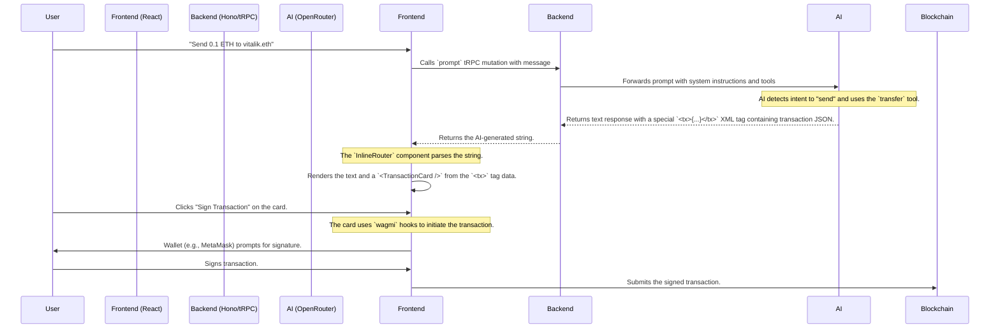
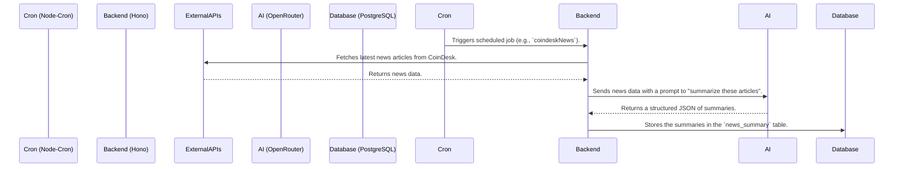

Here is a comprehensive and well-structured README for the `clar1k/sentia-turbo` repository.

---

\<div align="center"\>
\<br /\>
\
\<br /\>
\<h1 style="border-bottom: none;"\>Sentia Turbo\</h1\>
\<p\>\<b\>An AI-powered Web3 assistant that bridges the gap between conversation and on-chain action.\</b\>\</p\>
\<br /\>

\<p\>
\<a href="\#"\>\\</a\>
\<a href="\#"\>\\</a\>
\<a href="\#"\>\\</a\>
\</p\>

\</div\>

**Sentia Turbo** is a full-stack monorepo showcasing a sophisticated, tool-enabled AI agent for the Web3 space. It's more than just a chatbot; it's an interactive assistant that can understand user intent, fetch real-time financial data, and generate transactions that users can sign and execute directly from the chat interface.

The backend also features autonomous AI agents that run on a schedule to fetch, analyze, and summarize the latest news, financial, and DeFi data, providing users with timely, AI-generated insights on dedicated dashboards.

---

### 🌟 Core Features

| Feature                       | Description                                                                                                                                                                                            |
| ----------------------------- | ------------------------------------------------------------------------------------------------------------------------------------------------------------------------------------------------------ |
| 🤖 **Tool-Enabled AI Agent**  | A conversational chat interface where the AI can use custom tools to perform actions, such as fetching a user's wallet balance or generating transaction data.                                         |
| 💳 **Inline Transaction UI**  | A novel feature where the AI's intent to perform a transaction is rendered as an interactive UI component (`<TransactionCard />`) directly in the chat, powered by a custom `<tx>` tag protocol.       |
| 🔒 **Web3 Authentication**    | Secure wallet-based authentication using [Dynamic](https://www.dynamic.xyz/) and SIWE (Sign-In with Ethereum), integrated with a tRPC backend.                                                         |
| 📊 **AI-Powered Dashboards**  | Dedicated dashboards for Finance, DeFi, and News, populated with data and insights generated by autonomous, scheduled AI agents.                                                                       |
| 🕒 **Scheduled AI Summaries** | Backend cron jobs periodically fetch data from sources like DeFiLlama, CoinGecko, and CoinDesk, use an LLM to create insightful summaries, and store them in the database for the frontend to display. |
| 🚀 **Modern Monorepo Stack**  | Built with Turborepo, Bun, React, Vite, Hono, and tRPC for a fully type-safe, high-performance developer experience.                                                                                   |

### 🎬 Demo

Imagine asking your AI assistant to make a payment. Sentia understands your request, generates the transaction, and presents it to you for approval, right in the chat.

_(Placeholder for a GIF demonstrating the inline transaction card flow: User types "Send 0.1 ETH to vitalik.eth" -\> AI responds with text and a TransactionCard -\> User clicks "Sign Transaction" and confirms in their wallet.)_

### ⚙️ How It Works

Sentia's power comes from two primary flows: the interactive user-to-AI pipeline and the autonomous backend agent pipeline.

#### 1\. Interactive Transaction Flow

This flow demonstrates how Sentia turns natural language into on-chain actions.



#### 2\. Autonomous Summary Flow

This flow shows how the dashboards are powered by scheduled, AI-generated content.



### 🛠️ Tech Stack

| Area         | Technology                                                                                                                                                                                                                                                                                                                                   |
| ------------ | -------------------------------------------------------------------------------------------------------------------------------------------------------------------------------------------------------------------------------------------------------------------------------------------------------------------------------------------- |
| **Monorepo** | \   \                                                                                                                                                                                                          |
| **Frontend** | \ \ \ \ \ \ |
| **Backend**  | \ \ \                                                                                                                                                                            |
| **Database** | \ \                                                                                                                                                                                                                           |
| **Auth**     | \                                                                                                                                                                                                                                                                                        |

### 📂 Project Structure

The repository is a Turborepo monorepo with two main applications.

```
clar1k-sentia-turbo/
├── apps/
│   ├── server/      # Backend: Hono, tRPC, Drizzle ORM, AI logic, and scheduled jobs
│   └── web/         # Frontend: React (Vite), TanStack Router, and components
└── package.json     # Root package configuration
```

### 🚀 Getting Started

Follow these steps to get your local environment up and running.

#### 1\. Prerequisites

- [Bun](https://bun.sh/) (v1.2.12 or higher)
- [PostgreSQL](https://www.postgresql.org/)
- [Node.js](https://nodejs.org/) (for certain dependencies)

#### 2\. Clone & Install

```bash
# Clone the repository
git clone https://github.com/clar1k/sentia-turbo.git

# Navigate to the project directory
cd sentia-turbo

# Install all dependencies using Bun
bun install
```

#### 3\. Environment Setup

This project requires environment variables for both the frontend and backend.

1.  **Backend (`apps/server`)**

    - Copy the example environment file: `cp apps/server/.env.example apps/server/.env`
    - Fill in the required values:
      - `DATABASE_URL`: Your PostgreSQL connection string.
      - `OPENROUTER_API_KEY`: Your API key from [OpenRouter.ai](https://openrouter.ai/) for LLM access.
      - `DYNAMIC_API_KEY`: Your Environment ID from [Dynamic](https://app.dynamic.xyz/).
      - `JWT_SECRET`: A secure, random string for signing internal JWTs (not used for Web3 auth).

2.  **Frontend (`apps/web`)**

    - Copy the example environment file: `cp apps/web/.env.example apps/web/.env`
    - Fill in the required values:
      - `VITE_SERVER_URL`: The full URL of your backend server (e.g., `http://localhost:3000`).
      - `VITE_DYNAMIC_API_KEY`: The same Environment ID from Dynamic used in the backend.

#### 4\. Database Setup

With your `DATABASE_URL` configured, push the Drizzle schema to your PostgreSQL database.

```bash
# This command runs the db:push script defined in the server's package.json
bun db:push
```

You can also use the Drizzle Studio to explore your database:

```bash
bun db:studio
```

#### 5\. Run the Development Servers

Start both the frontend and backend applications in development mode.

```bash
bun dev
```

- The **Frontend** will be available at [http://localhost:3001](https://www.google.com/search?q=http://localhost:3001).
- The **Backend** API will be running at [http://localhost:3000](https://www.google.com/search?q=http://localhost:3000).

### 💡 Key Concepts

- **The `<tx>` Protocol:** The core of the agent's interactive power lies in a simple convention. When the AI's response includes a `<tx>` tag, the frontend knows to parse its content as JSON and render the `TransactionCard` component. This is handled in `apps/web/src/components/inline-components/InlineRouter.tsx`.

- **AI Tooling:** The AI's capabilities are defined in `apps/server/src/lib/mcp/tools.ts`. The Vercel AI SDK allows the LLM to decide which tool to use based on the user's prompt, making the interaction dynamic and intelligent.

- **System Prompt:** The AI's personality, rules, and constraints are defined in the system prompt located at `apps/server/src/lib/prompts/system.ts`. This is critical for ensuring the AI behaves as expected and follows safety guidelines.

---

### 🙏 Acknowledgements

This project was initialized using the fantastic [Better-T-Stack](https://github.com/AmanVarshney01/create-better-t-stack).
